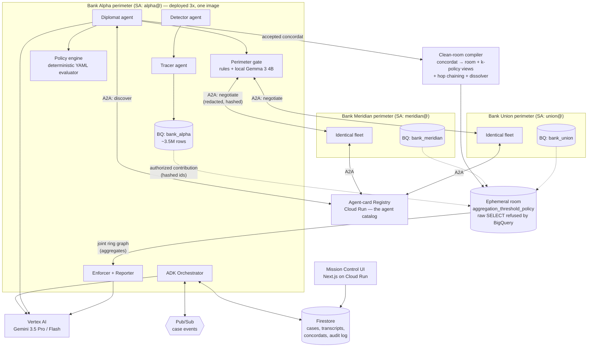

# ARCHITECTURE.md — Concordat

> Source of truth for the submission's architecture diagram. Export a rendered version to
> `docs/architecture.png` before Aug 27 (diagram is a mandatory submission item).

## System overview

Three sovereign bank fleets (identical codebase, isolated config/IAM/data) + two shared neutral
services (registry, clean-room compiler) + one observer UI. Everything on Cloud Run; all
cross-agent traffic is A2A messages; all intra-case orchestration is Pub/Sub-driven and resumable
from Firestore.



## The six invariants (put these on the diagram slide — they ARE the architecture)

1. **Sovereignty**: each bank is a **separate GCP project** with its own ledger, identity,
   topic and case store. A bank's service account does not appear in any peer's project at
   all, so a cross-perimeter read fails with a 403 from Google rather than a check in our
   code. The only route between banks is a clean room compiled from an accepted concordat.
   Reproduce with `scripts/verify_sovereignty.py`.
2. **Deterministic veto**: Gemini drafts proposals and reports; the YAML policy evaluator (plain
   code) has final say on anything crossing the boundary. LLMs propose, policy disposes.
3. **Perimeter gate**: every outbound free-text field passes deterministic redaction rules and
   then a Gemma 3 4B running *inside the bank's own container* — the text being checked for
   leaks never leaves the bank to be checked. Rules are the guarantee; Gemma can only add a
   restriction. Identifiers leave only as salted hashes, and only in sets of at least k.
4. **Ephemerality**: rooms carry the concordat's TTL. Dissolution is *cooperative*, not central:
   the room runner drops the room, and each bank revokes its own contribution view — the runner
   has no delete rights inside anyone's dataset. The audit record is the only survivor.
5. **Asynchrony**: no request/response chains across the system — Pub/Sub events + Firestore
   state; any service can die mid-case and the case resumes.
6. **Auditability**: every negotiation round, policy verdict, clean-room query, and enforcement
   action is an append-only Firestore audit entry with actor + timestamp + payload hash.

## Case lifecycle (state machine)

```
detected → tracing → dead_end → discovering → negotiating ⇄ countering
   → agreed → room_active → joint_analysis → awaiting_approval → enforcing → closed
                    ↘ rejected (terminal, audit-logged — the governance demo path)
```

## Negotiation protocol (A2A message types)

| Message | Sender | Content |
|---|---|---|
| `InvestigationRequest` | initiating diplomat | case summary (redacted), requested computations, proposed k/TTL |
| `PolicyVerdict` | responding policy engine | accept / reject with violated-rule references |
| `CounterProposal` | responder | narrowed computations / raised k / shorter TTL |
| `ConcordatSigned` | both | final terms; hash of terms doubles as clean-room config key |
| `ContributionRequest` | initiator | probe set (>= k hashes), room, k, salt, window |
| `ContributionReceipt` | peer | k-thresholded aggregate only — never rows |
| `RevokeContribution` | initiator | asks a peer to withdraw its own view |
| `RoomDissolved` | peer/compiler | closure record for all parties' audit logs |

All messages: Pydantic-validated, transcript-persisted, replayable in the UI.

## Where each judging axis is won

- **Innovation/utility (40%)**: the negotiation layer + federated model (see SPEC novelty ledger).
- **Architecture (30%)**: the six invariants above; one parameterized bank image deployed 3×;
  event-driven long-running cases.
- **Demo/production-readiness (30%)**: IAM-proven isolation, audit trail, approval gates,
  CI/CD, deterministic `make demo`.
