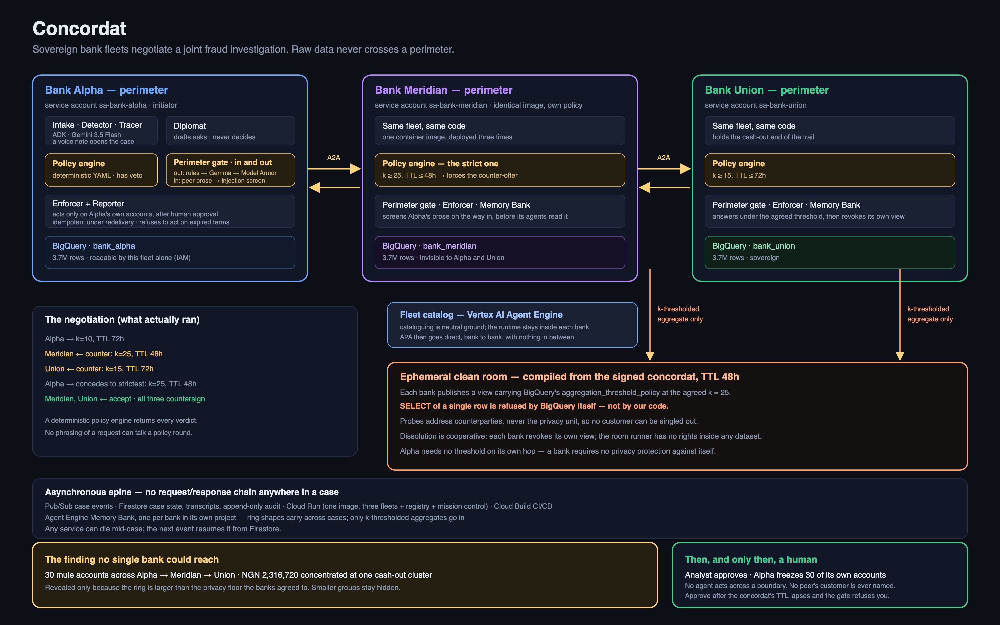
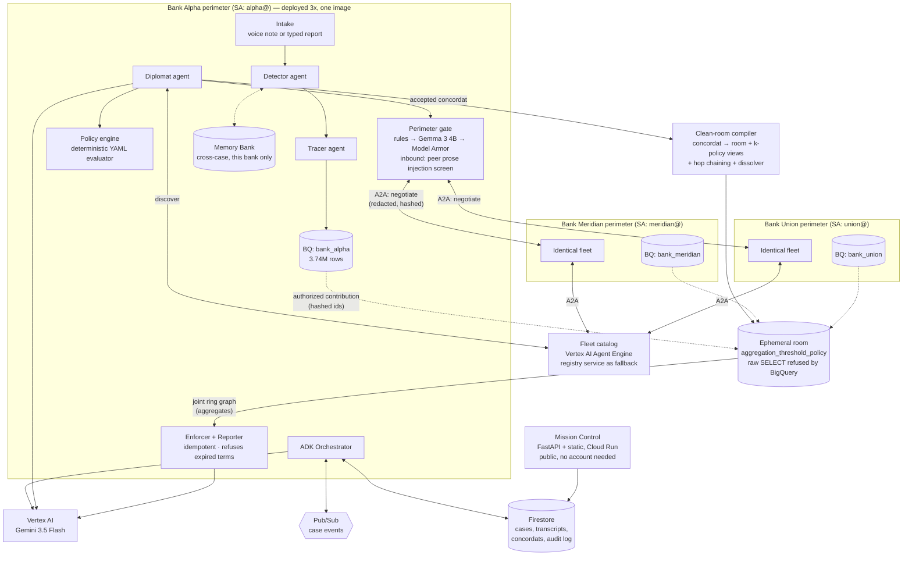

# Concordat

> Sovereign AI agent fleets, owned by rival banks, that **negotiate** privacy-safe joint fraud
> investigations — then compile the agreement into an ephemeral BigQuery clean room, catch the
> cross-bank ring, act only inside their own perimeters, and dissolve the room.

Entry for the **All Things Agentic Hackathon** (Devpost, Aug 2026) — *Fortified Enterprise Fleet* track. Built solo, Aug 2026.

---

## Judges: 30 seconds, no setup

The dashboard is public and needs no account:
**https://mission-control-fa7ntw3nkq-uc.a.run.app**

To walk a real investigation end to end from a terminal, fetch the one script the dashboard
serves. No clone, no credentials and no GCP project: it talks to the public deployment over
`curl`, and needs nothing but `python3` locally.

```bash
curl -sO https://mission-control-fa7ntw3nkq-uc.a.run.app/judge_replay.sh
bash judge_replay.sh              # the newest completed case, beat by beat
APPROVE=1 bash judge_replay.sh    # and exercise the human approval gate yourself
```

It is served as plain text so you can read it before you run it, and it is the same file as
`scripts/judge_replay.sh` if you would rather clone.

It prints the solo trace hitting the perimeter, the negotiation with both peers pushing
back, the joint finding no bank could reach alone, and every outbound payload the perimeter
gate screened. `make test` runs 73 tests with no cloud access at all.

---

## System Overview & Architecture



Three sovereign bank fleets (identical codebase, isolated config/IAM/data) + two shared neutral
services (registry, clean-room compiler) + one observer UI. Everything on Cloud Run; all
cross-agent traffic is A2A messages; all intra-case orchestration is Pub/Sub-driven and resumable
from Firestore.

Managed Google Cloud components sit at the three places where a bank would refuse to take our
word for it:
- **Vertex AI Agent Engine** holds the fleet catalog in the commons — registry entries are public facts, so cataloging is neutral ground while execution stays sovereign.
- **Agent Engine Memory Bank** gives each bank cross-case memory *inside its own project*, so nothing about one bank's investigative history is legible to a rival.
- **Model Armor** guards both edges of every perimeter: a third opinion on text leaving, and prompt-injection screening on peer prose arriving, because a counterparty's free text is written by a rival's LLM and lands in the context of ours.



### The Seven Architectural Invariants

1. **Sovereignty**: Each bank is a **separate GCP project** (`concordat-alpha`, `concordat-meridian`, `concordat-union`) with its own ledger, identity, topic, and case store. A bank's service account does not appear in any peer's project at all, so a cross-perimeter read fails with a 403 from Google rather than a check in our code. The only route between banks is a clean room compiled from an accepted concordat. The commons holds no bank's ledger.
2. **Deterministic veto**: Gemini drafts proposals and reports; the YAML policy evaluator (plain code) has final say on anything crossing the boundary. LLMs propose, policy disposes.
3. **Perimeter gate**: Every outbound free-text field passes deterministic redaction rules, then a Gemma 3 4B running *inside the bank's own container* (the text being checked for leaks never leaves the process), and finally Model Armor (Google's detector in the bank's own project). Inbound peer prose passes Model Armor prompt-injection screening before our agents read it. Identifiers leave only as salted hashes in sets of at least *k*.
4. **Ephemerality**: Clean rooms carry the concordat's TTL. Dissolution is *cooperative*, not central: the room runner drops the room, and each bank revokes its own contribution view — the runner has no delete rights inside anyone's dataset. The audit record is the only survivor.
5. **Asynchrony**: No request/response chains across the system — Pub/Sub events + Firestore state; any service can restart mid-case and the case resumes. Resumption holds across every state transition (`RESUMABLE_FROM` in `services/bank/case.py`).
6. **Auditability**: Every negotiation round, policy verdict, clean-room query, and enforcement action is an append-only Firestore audit entry with actor + timestamp + payload hash.
7. **Memory is sovereign too**: Each fleet's cross-case memory lives in that bank's own Memory Bank in its own project. Only k-thresholded aggregates go in — the shape of a network, never an individual person.


---

## The problem

The same mule network hits five banks at once. Each bank sees one fragment of the trail, and
privacy law forbids them from pooling raw customer data — so cross-institution rings are
systematically under-detected. Existing consortia solve this by shipping everything to one
central provider, which is the arrangement privacy teams resist most.

## What Concordat does

Each bank runs its own fleet inside its own perimeter. When a trace dies at a boundary, the
fleet doesn't give up — it **parleys**:

1. **Discovers** counterpart fleets through an A2A agent-card registry.
2. **Negotiates** the terms of a joint investigation. Gemini drafts the ask; a deterministic
   policy engine on each side decides. Banks counter-offer, and the strictest terms win.
3. **Compiles** the signed agreement into an ephemeral BigQuery clean room where every
   contribution carries an `aggregation_threshold_policy` — BigQuery itself refuses to return
   a row, so no party can read another's ledger even by accident.
4. **Acts** only inside its own walls, behind a human approval gate.
5. **Dissolves** the room. Each bank revokes its own contribution; only the audit trail survives.

A verified run: Alpha traced ₦2.4M through 30 mule accounts to its boundary and stopped.
Meridian countered its opening terms (k 10 → 25, TTL 72h → 48h); Union countered too; all three
signed at the strictest terms. The room revealed **30 mule accounts across all three banks,
₦2,316,720 concentrated at a single ATM cluster** — a finding no bank could reach alone. An
analyst approved, and Alpha froze 30 of *its own* accounts. Peers' customers were never named.

## Stack

Gemini 3.5 Flash (Vertex AI) · Google ADK · A2A protocol · **Gemma 3 4B running locally in each
bank's container** · Cloud Run · Pub/Sub · Firestore · BigQuery with aggregation-threshold
privacy policies · **Vertex AI Agent Engine** as the fleet catalog · **Agent Engine Memory
Bank**, one per bank · **Model Armor** at both edges of every perimeter · Cloud Text-to-Speech
for the synthetic voice note.

Where each of those earns its place:

| Component | Job | Why not something simpler |
|---|---|---|
| **Agent Engine** | The catalog: which fleets exist, which scheme they speak, where their card lives | Registry entries are public facts, so they belong on neutral ground. The *runtime* deliberately stays in each bank — three rivals' investigators in one managed project is the arrangement this project argues against. |
| **Memory Bank** | Cross-case memory, in each bank's own project | Every case used to start from nothing. Findings are k-thresholded, so what carries forward is the shape of a network, never a person. |
| **Model Armor** | Third opinion outbound; prompt-injection screening inbound | Our regexes cannot catch a customer's *name*, and a peer's free text is prose written by a rival's LLM landing in the context of ours. |
| **Gemma 3 4B, in-container** | Semantic check on outbound text | It never leaves the process, so the text being checked for leaks is not itself disclosed in order to check it. |

## Try it

Prerequisites: `gcloud` authenticated, Python 3.12, and four GCP projects with billing —
one commons plus one per bank. The project boundary *is* the security model.

```bash
python3 -m venv .venv && .venv/bin/pip install -e .   # or: uv venv && uv pip install -e .
make test                                             # 73 tests, no cloud needed

# commons: neutral ground only (registry, mission control, clean rooms)
bash infra/setup_deploy.sh          # artifact registry + build permissions
bash infra/setup_cleanroom.sh       # the neutral room-runner identity
bash infra/setup_ui.sh              # the observatory identity

# one sovereign perimeter per bank, each in its OWN project
for bank in alpha meridian union; do bash infra/federate.sh $bank; done

make seed        # 11.2M synthetic rows; each ledger loads into its own project
make deploy      # one image -> three projects, plus registry and mission control
bash infra/setup_deploy.sh --push               # Pub/Sub push subscriptions per project
bash infra/setup_a2a.sh --invokers --register   # peer IAM + publish agent cards
make demo        # run the golden path end to end and print the case as it unfolds
```

Health checks use `/health`, not `/healthz`: Google's frontend answers that exact path with
its own 404 before the request reaches the container, so a healthy service looks broken.

Two more things worth running:

```bash
.venv/bin/python -m scripts.verify_sovereignty  # prove the perimeters, incl. the 403s
.venv/bin/python -m scripts.demo_rejection      # ask a peer for too much; watch it refuse
.venv/bin/python -m scripts.eval_gemma_gate models/gemma-3-4b-it-Q4_K_M.gguf
.venv/bin/python -m scripts.test_armor          # live Model Armor, both directions
BANK=alpha .venv/bin/python -m scripts.voice_case   # file a case by voice note
```

The platform pieces are provisioned separately, once, and each script is idempotent:

```bash
bash infra/setup_armor.sh           # Model Armor + DLP templates, per bank
bash infra/setup_memory.sh          # one Memory Bank per bank, in its own project
bash infra/setup_agent_registry.sh  # publish the fleet catalog to Agent Engine
```

All data is synthetic and generated locally from a fixed seed (`data/generator/`). No real
transaction data exists anywhere in this project.

## The perimeters are real

Each bank is a **separate GCP project** — `concordat-alpha`, `concordat-meridian`,
`concordat-union` — with its own ledger, service account, event topic and case store. The
commons project holds only neutral ground: the agent-card registry, mission control, and the
clean rooms. It holds no bank's ledger.

```
$ .venv/bin/python -m scripts.verify_sovereignty

   concordat-alpha      sa-bank-alpha@concordat-alpha  +  sa-cleanroom@concordat-hack
   concordat-meridian   sa-bank-meridian@...           +  sa-cleanroom@concordat-hack
   concordat-union      sa-bank-union@...              +  sa-cleanroom@concordat-hack
   No bank appears in another bank's project.

   sa-bank-alpha -> its own ledger    : 3,743,998 rows
   sa-bank-alpha -> meridian's ledger : refused — 403 Access Denied (concordat-meridian)
   sa-bank-alpha -> union's ledger    : refused — 403 Access Denied (concordat-union)
```

In one project you can only show that you *chose* not to grant access. Across projects, the
access does not exist to grant.

## How the privacy guarantee is enforced

Not by our code either, which is the point:

```
$ SELECT account_hash FROM bank_meridian.contribution_<digest> LIMIT 5
400 You must use SELECT WITH AGGREGATION_THRESHOLD for this query
    because a privacy policy has been set by a data owner.
```

On top of that, each bank's service account can read only its own dataset (IAM, not
convention), every outbound message passes a local redaction gate before it can cross a
boundary, and hashed account sets are withheld unless they contain at least *k* members — so a
probe can never single anyone out.

## Six things this build taught me

The judges asked for the interesting parts, so here they are, including the ones that were
mistakes.

**A privacy floor will hide your own evidence from you.** The first working clean room
returned nothing. Meridian's policy demanded k=25 and the planted ring had 8 cash-out
accounts, so BigQuery correctly suppressed the answer — the guarantee worked exactly as
designed and the demo died. The fix was not to lower k. It was to admit the ring was
unrealistically small: real mule networks are wide, so the generator now plants 30 accounts
per layer. A privacy threshold is a statement about how many people you must be hiding among,
and a system that only works on tiny rings was never going to be honest.

**Two agents can agree on the rules and still deadlock.** Meridian's policy capped boundary
hashes at 20 while demanding a minimum group size of 25 — so no proposal could satisfy both,
and the negotiation looped until it hit max rounds. Policies are now validated for internal
coherence at load time, and probe width is explicitly non-negotiable. An agent that can
counter-offer forever is not flexible; it is broken.

**"Resumable" has to hold at every step, not just the clean ones.** Three unattended runs
froze in `negotiating`. A peer had scaled to zero, the agent-card fetch got a Cloud Run 500,
and the handler died — *after* the status had already moved and been persisted. Pub/Sub
redelivered exactly as designed, and a guard that only accepted `dead_end` turned it away.
A two-second network blip became a permanently stranded case. The bug was not the cold
start; it was a state machine and a guard that disagreed about what "in progress" means.

**Deployment configuration is code, and it fails silently.** `--set-env-vars` replaces the
whole environment rather than adding to it, so a routine redeploy wiped the three endpoints
mission control needs and every approval started returning 500. Separately, the Dockerfile
pins its own dependency list, so a package added to `pyproject.toml` alone is simply absent
at runtime — which is how Model Armor reported "unavailable" in production while passing
every test locally. Both failures were invisible until something was clicked.

**Sovereignty is only checkable across projects.** Inside one project you can only show that
you *chose* not to grant access — a reviewer has to trust your IAM hygiene. Across projects,
`sa-bank-alpha` reaching for Meridian's ledger gets a 403 from Google, not from our code.
That is why this runs on four projects instead of one, and it is the single change that made
the central claim verifiable rather than asserted.

**The model is the least trustworthy component, so give it the least authority.** Gemini
drafts every proposal and never approves one; a deterministic policy engine returns the
verdict. Gemma can only tighten the perimeter gate, never loosen it. Model Armor can withhold
a payload, never release one. It was tempting to let the model arbitrate — it is better at
nuance than a YAML file — but "the LLM decided it was fine" is not a sentence a bank's risk
committee will ever accept, and building as if it were would have made the whole thing a toy.

## Repository layout

```
services/bank/       one fleet, deployed three times (config, agents, policy, a2a, redaction)
  intake.py          a customer's voice note -> a case (Gemini, multimodal)
  memory.py          cross-case memory in this bank's own Memory Bank
  redaction/         rules -> Gemma (in-container) -> Model Armor, outbound and inbound
services/cleanroom/  room compiler, k-thresholded contributions, dissolver
services/registry/   the fleet catalog: Agent Engine, with our own service as fallback
services/ui/         mission control
data/generator/      synthetic ledgers with planted rings + BigQuery loader
data/intake/         the synthetic voice note the demo files
infra/               idempotent setup scripts and Cloud Build pipeline
scripts/             demo drivers, evals, verification runs, and judge_replay.sh
```
